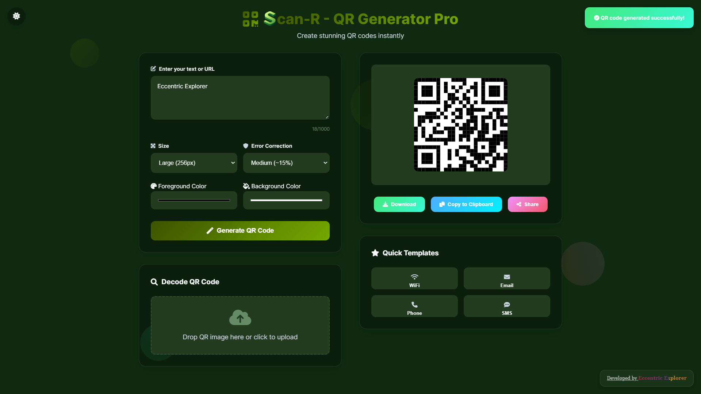

<div align="center"></div>
# <div align="center">SCAN-R - QR GENERATOR PRO/div>

## A modern, feature-rich JavaScript-based QR code generator and scanner

Scan-R is a user-friendly web application that allows you to effortlessly generate custom QR codes through various options, and scan/upload and decode existing ones. With a sleek, animated interface and support for both light and dark themes, Scan-R provides a seamless experience for all your QR code needs.

## ✨ Features

  * **Customizable QR Code Generation**:
      * Generate QR codes from any text or URL.
      * Adjust QR code size and error correction levels (L, M, Q, H).
      * Select custom foreground and background colors.
      * Download generated QR codes as PNG images, Copy them to clipboard or Share them directly (through apps supported by the browser/OS).
  * **QR Code Scanning and Decoding**:
      * Upload QR code images to decode their content.
      * Drag-and-drop functionality for easy image upload.
      * Option to use your device's camera for live QR code scanning.
      * Copy decoded text to clipboard or use it directly in the generator.
  * **Quick Templates**:
      * Generate QR codes for common use cases like Wi-Fi network credentials, email messages, phone numbers, and SMS messages using dedicated templates.
  * **Interactive UI and Responsive Design**:
      * Smooth animations and transitions for a delightful user experience.
      * Light and Dark theme toggle to suit your preference.
      * Dynamic background animations with floating shapes.
      * Optimised for various screen sizes, from desktops to mobile devices.

## 🚀 Live Demo

Experience Scan-R live here: [**SCAN-R**](https://www.google.com/search?q=https://eccentricexplorer.github.io/Scan-R)

*Please note: Due to browser security restrictions, the camera scanning feature and certain share functionalities work only on a live server (like the hosted demo) or when served locally via a tool like Live Server in VS Code.*

 <div align="center">
 <p>

[](https://github.com/ellerbrock/open-source-badges/)


 </p>
 </div>

## 📸 Screenshots

### Light Mode

<div align="center"></div>

### Dark Mode

<div align="center"></div>

## 📺 Video Explanation

For a detailed walkthrough of Scan-R's features and how to use them, check out this video:

**[Insert YouTube Video Link Here]**

## 🛠️ Technologies Used

  * **HTML5**: Structure of the web application.
  * **CSS3**: Styling and animations, including CSS variables for theming.
  * **JavaScript**: Core logic for QR code generation, decoding, theme toggling, and interactive elements.
  * **qrcode-generator library**: Used for generating QR codes.
  * **qr-scanner library**: Used for decoding QR codes from images and camera feed.
  * **Font Awesome**: Icons for a better user interface.

## ⚙️ How to Run Locally

1.  **Clone the repository:**

    ```bash
    git clone https://github.com/EccentricExplorer/Scan-R.git
    ```

2.  **Navigate to the project directory:**

    ```bash
    cd Scan-R
    ```

3.  **Open with a Live Server:**
    Scan-R requires a live server environment to function correctly, especially for the camera scanning and certain sharing features (due to browser security policies).

      * **VS Code Extension:** If you use VS Code, you can install the "Live Server" extension by Ritwick Dey. Right-click on `index.html` and select "Open with Live Server".
      * **Other options:** You can also use `http-server` (Node.js package) or any other local server software.

    ```bash
    # If you have Node.js installed, you can install http-server globally:
    npm install -g http-server
    # Then navigate to your project directory and run:
    http-server
    ```

    Your default browser will open the application, usually at `http://127.0.0.1:5500` or `http://localhost:8080`.

## Issue Creation ✴
Report bugs and  issues or propose improvements through our GitHub repository.

## Contribution Guidelines 📑

- Firstly Star(⭐) the Repository
- Fork the Repository and create a new branch for any updates/changes/issue you are working on.
- Start Coding and do changes.
- Commit your changes
- Create a Pull Request which will be reviewed and suggestions would be added to improve it.
- Add Screenshots and updated website links to help us understand what changes is all about.

- Check the [CONTRIBUTING.md](CONTRIBUTING.md) for detailed steps...

    
## Contributing is fun🧡

Enhance Scan-R with your contributions! Whether you have innovative suggestions, spot bugs, or wish to introduce new features.
Contributions of any kind from anyone are always welcome🌟❕

Your insights are invaluable to us. Reach out to us team for any inquiries, feedback, or concerns.

## 📄 License

This project is open-source and available under the MIT License.

## 📞 Contact

Developed by [Eccentric Explorer](https://eccentriccoder01.github.io/Me)

Feel free to reach out with any questions or feedback\!